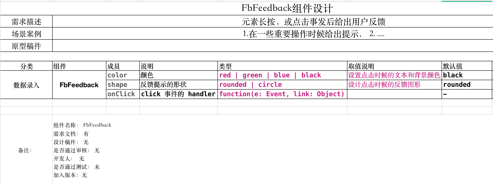
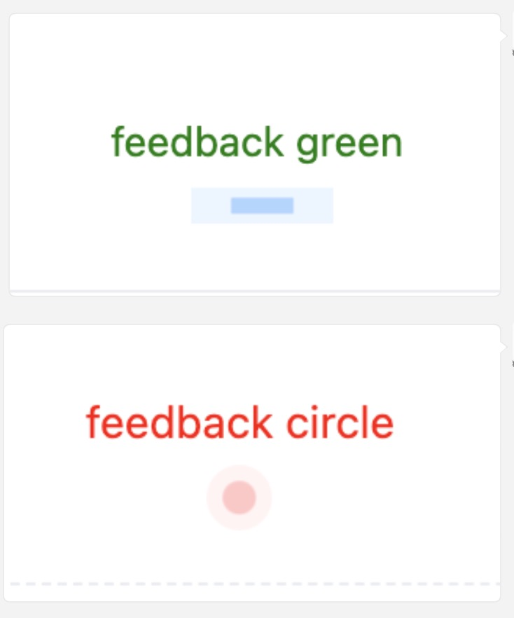
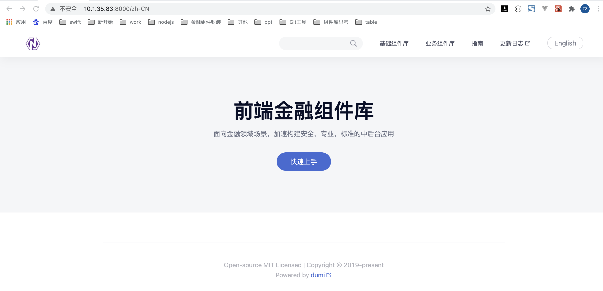
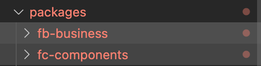
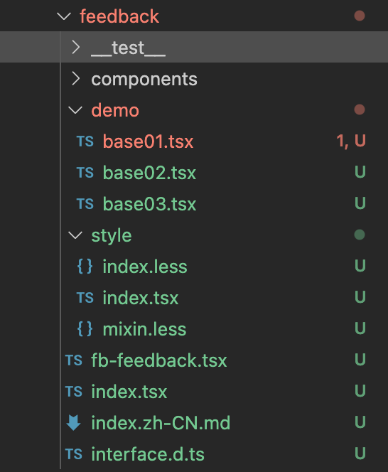

# 如何开发一个组件？

> 本文主要讲解如何开发一个全新的组件，以及提供一个`通用的范式`描述组件核心逻辑层的书写。
> 开发者需预备：`React`, `antd`, `Typescript`, `git`知识

## 开发准备

1. 在开发前请从项目负责人获取组件`API描述文档`和`组件原型设计`,并阅读右侧导航的`工作流`以及`开发教程`文档。
1. 金融组件库共分为基础组件库 `fc-components` 和 业务组件库`fb-business`
1. 各组件的代码存储在 src 目录平级展示 如： src/button, src/auto-complete
1. 组件`文件夹和文件`采用`小写，横线`组合， 如： 文件夹 button, auto-complete 文件：index.tsx, fc-button.tsx
1. 组件的导出统一采用大驼峰命名,`基础组件`以`Fc`开头, 如： FcButton，`业务组件`以`Fb`开头, 如： `FbFeedback`，
1. 单个组件文件夹内部包含如下基础文件

```jsx | pure
  __test__           //测试文件
  components         //组件依赖的子组件文件
  demo               //使用案例
  style              //样式，内部统一使用less,css
  index.tsx          //组件入口文件
  index.zh-CN.md     //使用的文档
  ...                //其他组件专属的文件， 如果过多请创建文件夹存储
```

> 下面以模拟在`业务组件库`文件夹 `fb-business`中， 开发一个`FbFeedback`组件为例作为讲解

## 开发步骤

> 开发一个组件大致细分为如下步骤， 后面是每一步具体的操作

```
0. 获取组件资料
1. 安装运行项目
2. 熟悉组件源码包
3. 编写组件代码
4. 在src中导出组件
5. 书写demo案例
6. 书写使用api文档
7. 书写测试用例
8. 提交代码分支
```

### 0.获取组件资料

> 在进行组件开发之前，首先需要联系负责人获得开组件的 api 资料和设计稿件

feedback 组件(api 设计文档)


feedback 组件(原型或设计图稿)



### 1.安装运行项目

> 首先需在本地创建一个 git 工程，或直接克隆 dev 分支，然后安装运行。

```jsx | pure
// 获取项目源码
mkdir ngfed && cd ngfed
git init
git remote add origin  http://172.16.80.120/sdebank-ngfe/ngfed
git checkout -b dev origin/dev

// 安装依赖
npm run init

// 运行项目
npm run start
```

运行后切换如中文界面


### 2.熟悉组件目录

> packages 文件是整个工程的源码目录 fc-components 是基础组件，fb-business 是业务组件 内部 src 是各个层级组件的源码。



- 开发业务组件进入 `fb-business/src` , 基础组件进入 `fc-components/src`
- 每个组件源码平级排列，文件夹名称统一采用`小写`和`横线`
- `index.ts` 为所有组件的入口, 每个书写完毕的组件要在此导出供外部使用
- `util`文件夹为工具函数目录
- 在进行组件编码工作前，请大家仔细阅读`本文档`和右侧导航`工作流`中的`开发规范`

### 3.编写组件逻辑

> 下方 feedback 组件的最终所包含的文件，我们会依序创建完成书写。此处我们先预览组件的文件结构



- 3.1 创建 `feedback` 目录
- 3.2 创建 `src/feedback/index.tsx` 入口文件（单个组件文件入口） 书写组件逻辑代码。
- 3.3 注意 `index.tsx` 是组件入口文件,只承担导入导出

```jsx | pure
// index.tsx 中的内容
import FbFeedback from './fb-feedback'; //导入组件真正书写逻辑代码的文件
export default FbFeedback; //导出的组件必须Fb开头，大驼峰命名
```

- 3.4 组件文件名称采用`fb-组件名称`形式如： `src/feedback/fb-feedback.tsx`,

```jsx | pure
// fb-feedback.js 组件代码结构， （完整代码在页尾查找）

// 1.导入依赖
import React, { useState } from 'react';

// 2. 样式
import './style/index.less';

// 3. 泛型约束要实现的 api
export interface FeedBackProps {
  prefixCls?: string;
  color?: FeedBackColor;
  shape?: FeedBackShape;
  className?: string;
  children?: React.ReactNode;
  onClick?: React.MouseEventHandler<HTMLElement>;
}

// 4. 组件核心逻辑实现
const Feedback = React.forwardRef<unknown, FeedBackProps>(prop,ref){

  // 省略核心逻辑书写...
  // ....
}

// 5. 组件导出
export default Feedback;
```

- 3.5 创建`style`目录存放样式文件， 创建`index.less`书写样式，并在组件中引入

```less | pure
@import './mixin';

.ant-fb-feed {
  // 组件样式代码省略， 完整请在教程尾部查看
}
```

### 4.在 src 中导出组件

> 当我们书写完一个组件后，必须在组件库的`src/index.tsx`导出组件，方能在外部，或书写 demo 时候进行引用

```jsx | pure
export { default as FbFeedback } from './feedback';
```

### 5.书写 demo 案例

> 在`feedback`组件目录中创建`demo`文件夹存放`base01.tsx`使用案例, 请根据组件任务需求文件，完整书写所有案例

```jsx | pure
import React from 'react';
import { FbFeedback } from '@ngfed/fb-business';

export default () => {
  return (
    <>
      <FbFeedback color="red">
        <span>feedback red </span>
      </FbFeedback>

      <FbFeedback color="green">
        <span>feedback green </span>
      </FbFeedback>

      <FbFeedback color="blue">
        <span>feedback blue </span>
      </FbFeedback>

      <FbFeedback color="black">
        <span>feedback black </span>
      </FbFeedback>
    </>
  );
};
```

### 6.书写使用 api 文档

> 在`feedback`的`index.zh-CN.md`书写 api 使用文档

具体书写细节查阅 `开发规范`中的[API 使用文档规范](http://10.1.35.83:8001/zh-CN/workflow/%E5%B7%A5%E4%BD%9C%E6%B5%81/develop-rule#api-%E4%BD%BF%E7%94%A8%E6%96%87%E6%A1%A3%E8%A7%84%E8%8C%83)

文档中案例的链接方式如下：

```html
<code src="./demo/base01.tsx" /> //链接base01.案例
```

### 7.书写测试用例

> 在**test**创建`index.test.tsx`书写测试代码

```jsx | pure
import * as React from 'react';
import { render } from '@testing-library/react';
import FbFeedback from '../index';

test('FbFeedback test', () => {
  // 编写测试代码逻辑...
});
```

### 8. 提交代码

```jsx | pure
git status
git add .
git commit -m 'feat:完成feedback组件封装'
git pull origin dev
git push origin dev:dev-yongzhan
```

## 核心逻辑层

> 如何写出一个标准规范的组件，以`feedback`组件

```jsx | pure
1. 标准的导入导出
  1.1 组件入口文件统一导出Fc开头的组件名称，导入的文件名为小写 fc+组件名称，如fb-feedback.js
  1.2 组件中使用 export default 导出默认组件
  1.3 组件库使用 export { default as FbFeedback } from './feedback' 导出供外部，并放置在注释的模块区域。
2. 采用typescript语法，用接口约束参数和他的类型
  2.1 使用interface约束参数
  2.2 非基本类型的参数的类型定义，放在接口之前，可导入_util的type辅助生产想要的参数类型。
3. 优先采用 es6 函数式组件，采用hooks管理状态
  3.1 采用const定义函数组件。
  3.2 并用泛型约束接受的属性参数， 保障接口功能的实现。
4. 组件内部逻辑遵循统一的标准书写流程
  4.1 结构props参数
  4.2 获取全局配置 context 中组件统一的配置参数
  4.3 根据具体功能书写代码，绑定事件等操作，DOM事件需用泛型进行约束检查。
  4.4 样式文件统一书写在style目录中，并启用全局中统一配置的前缀。使用classNames库操控样式的变化。
  4.5 构建渲染节点，组合上面的属性，样式，事件等配置。返回渲染
5. 因为部分组件是有依存嵌套关系，并只能接收特定类型子组件。该类组件用interface约束组件类型对外名称。
6. 标准的组件样式书写
  6.1 样式统一写入每个组件的style文件
  6.2 组件中使用import './style' 导入加载的入口 index.ts文件
  6.3 index.ts 负责导入全局的less和当前组件的样式加载
  6.4 index.less 是该组件独立的样式
      * 负责加载主题，混合，和本地混合，
      * 定义项目前缀 + 组件前缀。作为样式选择其的前缀  如fc-btn, fc-fed ,fc是项目，btn和fed是组件前缀
  6.5 mixin是该组件的样式混合。主要用于生成组件样式
```

> 下方是 FbFeedback 组件完整代码代码。

### feedback 组件入口 index.tsx

> feedback/index.ts 文件

```jsx | pure
import FbFeedback from './fb-feedback';
export default FbFeedback;
```

### fb-business 项目入口 index.tsx

> src/index.ts 文件, 该文件导出组件供 demo 和外部调用。

```jsx | pure
export { default as FbFeedback } from './feedback';
```

### fb-feedback.js 核心逻辑

> feedback/fb-feedback.js 文件， 该文件是组件的核心逻辑

```jsx | pure
import React, { useState } from 'react';
import classNames from 'classnames';
import omit from 'rc-util/lib/omit';
import { Omit, tuple } from '../_util/type';
import devWarning from '../_util/devWarning';
import { ConfigContext } from '../config-provider';
import SizeContext, { SizeType } from '../config-provider/SizeContext';
import TouchFeedback from 'rmc-feedback';

import './style/index.less';

// 5. 因为部分组件是有依存嵌套关系，并只能接收特定类型子组件。该类组件用interface约束组件类型对外名称。
// 5.1 约束组件类型
interface CompoundedComponent
  extends React.ForwardRefExoticComponent<
    FeedBackProps & React.RefAttributes<HTMLElement>
  > {
  __NGFED_FEEDBACK: boolean;
}

// 2. 2.1 用type定义值的类型
const FeedBackColors = tuple('red', 'green', 'blue', 'black');
export type FeedBackColor = typeof FeedBackColors[number];

const FeedBackShapes = tuple('circle', 'round');
export type FeedBackShape = typeof FeedBackShapes[number];


// 2. 采用typescript语法，用接口约束参数和他的类型
// 2. 2.1 interface约束参数
export interface FeedBackProps {
  prefixCls?: string;
  color?: FeedBackColor;
  shape?: FeedBackShape;
  className?: string;
  children?: React.ReactNode;
  onClick?: React.MouseEventHandler<HTMLElement>;
}


// 3. 优先采用 es6 函数式组件，采用hooks管理状态
//   3.1 采用const定义函数组件。
//   3.2 并用泛型约束接受的属性参数， 保障接口功能的实现。
const InternalFeedback: React.ForwardRefRenderFunction<
  unknown,
  FeedBackProps
> = (props, ref) => {

  // 4. 组件内部逻辑标准书写流程
  // 4.1 解构props的值
  const {
    prefixCls: customizePrefixCls,
    color,
    shape = 'round',
    className,
    ...rest
  } = props;

  // 4.2 使用hooks获取context全局配置
  const { getPrefixCls } = React.useContext(ConfigContext);
  const size = React.useContext(SizeContext);

  // 4.3 根据组件功能书写逻辑，绑定事件。
  // 获取ref
  const feedBackRef = (ref as any) || React.createRef<HTMLElement>();

  // 事件
  const handleClick = (
    e: React.MouseEvent<HTMLButtonElement | HTMLAnchorElement, MouseEvent>,
  ) => {
    const { onClick } = props;
    (onClick as React.MouseEventHandler<
      HTMLButtonElement | HTMLAnchorElement
    >)?.(e);
  };

  // 4.4 标准的样式定义
  const prefixCls = getPrefixCls('fed', customizePrefixCls);

  // 使用classNames管理样式变化
  const activeStyle = { color: color };
  const classes = classNames(
    prefixCls,
    {
      [`${prefixCls}-${color}`]: color,
      [`${prefixCls}-${shape}`]: shape,
    },
    className,
  );

  // 4.5 构建渲染节点，组合上面的属性，样式，事件等配置。返回渲染
  const feedback = (
    <TouchFeedback
      {...props}
      activeClassName={classes}
      activeStyle={activeStyle}
    >
      <span ref={feedBackRef} style={{ padding: '20px' }} onClick={handleClick}>
        {' '}
        {props.children}{' '}
      </span>
    </TouchFeedback>
  );
  return feedback;
};


const Feedback = React.forwardRef<unknown, FeedBackProps>(
  InternalFeedback,
) as CompoundedComponent;

// 5.2 组件名称和类型
Feedback.displayName = 'Feedback';
Feedback.__NGFED_FEEDBACK = true;

// 1. 标准的导出方式
export default Feedback;
```

### style 样式中的入口 index.ts

> feedback/style/index.ts 文件

```jsx | pure
import '../../style/index.less';
import './index.less';
```

### style 样式中的 index.less

> feedback/style/index.less 文件 ，样式的入口文件

```less
// 导入主题和混合
@import '../../style/themes/index';
@import '../../style/mixins/index';
@import './mixin';

// 样式名称的前缀： 项目前缀+组件前缀
@fed-prefix-cls: ~'@{ant-prefix}-fed';

// Feedback styles
// -----------------------------
.@{fed-prefix-cls} {
  // 使用混合生成样式
  .fed();
  .fed-common();

  // 其他个性化的组件样式
  &-black {
    .fed-black();
  }

  &-red {
    .fed-red();
  }

  &-green {
    .fed-green();
  }

  &-blue {
    .fed-blue();
  }

  &-circle {
    .fed-circle();
  }

  &-round {
    .fed-round();
  }
}
```

### style 样式中的 mixin.less

> feedback/style/mixin.less 文件, 该文件负责生成具体的样式。

```less
// 基本样式
.fed() {
  position: relative;
  cursor: pointer;
  user-select: none;
  touch-action: manipulation;
  &,
  &:active,
  &:focus {
    outline: 0;
  }
  &:not([disabled]):hover {
    text-decoration: none;
  }
  &:not([disabled]):active {
    outline: 0;
    box-shadow: none;
  }
  &[disabled] {
    cursor: not-allowed;
    > * {
      pointer-events: none;
    }
  }
}

// 组件共有样式
.fed-common() {
  &:hover,
  &:focus,
  &:active {
    text-decoration: none;
  }

  &:before,
  &:after {
    position: absolute;
    content: '';
    display: block;
    left: 0;
    right: 0;
    bottom: 0;
    top: 80%;
  }
  &:before {
    animation: wave-animate 0.5s infinite ease-out;
  }

  &:after {
    opacity: 0;
    animation: wave-animate 0.5s 0.2s infinite ease-out;
  }
}

// 特有样式1
.fed-red() {
}

// 特有样式2
.fed-green() {
}
```

## 最终案例效果

<code src="../../packages/fb-business/src/feedback/demo/base01.tsx" />
