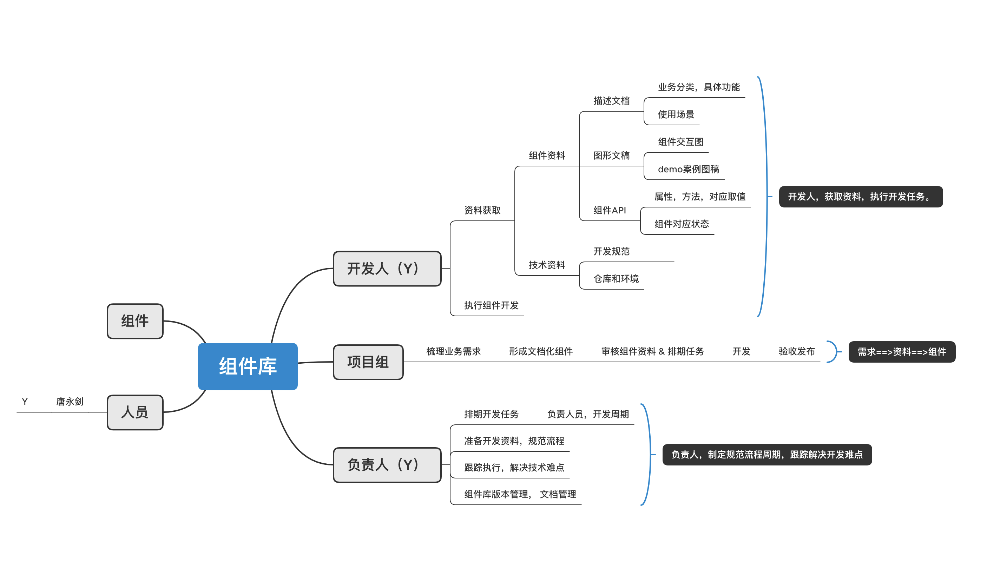

## 开发概览



## 主要步骤

```jsx | pure
一、组件开发前的准备：【 项目组 ｜ 负责人 】
    1. 梳理需求：
        - 集中讨论开发哪些组件, 形成统一格式的excel表格
        - 可从行方和开发项目中, 组件需能解决具体问题有必要性

    2. 组件设计： 形成文档，图像化
        - 需求文档，描述组件的具体功能，所属业务分类，推导出使用场景和案例
        - 图像化组件，形成基础线框图，demo案例图
        - 细化组件API属性和取值

    3. 审核 & 编排任务：
        - 对组件的交互功能设计，API，以及图形案例，技术实现，作正式开发前审核。
        - 对组件的具体开发，指派开发人员和周期。

二、组件开发实施过程：【 开发人 ｜ 负责人 】
    1. 开发人员基础要求，资料准备
        - 知识预备（前端知识，项目知识，指南阅读）
        - 规范阅读（代码，Git规范）
        - 任务列表
    2. 组件开发
        - 安装运行环境，运行项目
        - 创建新组件的开发分支
        - 编写组件逻辑
        - 书写demo案例
        - 书写测试代码
        - 书写使用文档
        - 按照规范提交
        - 任务完成标记
    3. 组件验收
        - 组件功能检查，例子，文档规范
        - 不通过修改，通过进入发布

三、项目打包发布：【负责人】
    1. 合并新组件代码到正式环境。
    2. 组件库版本控制，发布新版本前需要保留旧版本
    3. 同步打包部署，更新使用文档

```
